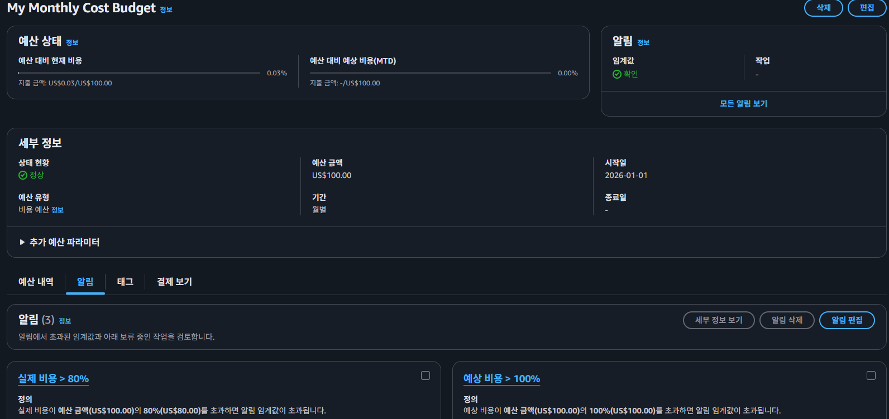
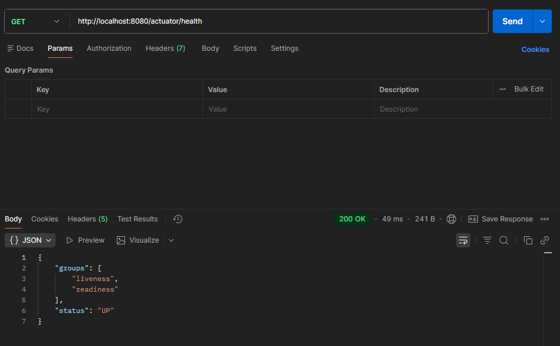
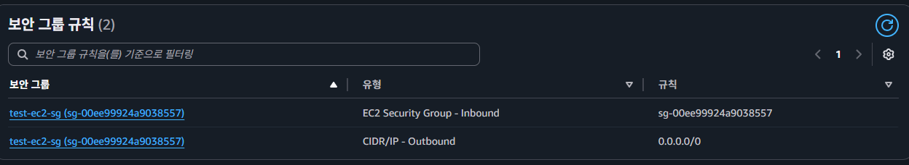

# Cloud Architecture & Deployment 과제

## LV 0. 요금 폭탄 방지 AWS Budget 설정

## Lv 1. 네트워크 구축 및 핵심 기능 배포
EC2 퍼블릭 IP: 43.201.54.111

## Lv 2. DB 분리 및 보안 연결하기
URL: http://43.201.54.111:8080/actuator/info

#### RDS 보안 그룹 설정
설정 내용: RDS 인바운드 규칙의 소스(Source)를 IP 주소(0.0.0.0/0)가 아닌 EC2 보안 그룹 ID(sg-00ee99924a9038557...)로 제한하여 데이터베이스 보안을 강화했습니다.

## Lv 3. 프로필 사진 기능 추가와 권한 관리
권한 관리: Access Key를 코드에 하드코딩하지 않고, S3 및 SSM 접근 권한이 있는 IAM Role을 생성하여 EC2 인스턴스에 연결했습니다.

#### 프로필 이미지 API 구현
업로드 API: POST /api/members/{id}/profile-image
이미지를 S3에 업로드하고 해당 경로(Key)를 DB에 저장합니다.

#### 조회 API: GET /api/members/{id}/profile-image
호출 시 S3의 비공개 객체에 접근할 수 있는 Presigned URL을 반환합니다.

#### Presigned URL 발급 결과
발급받은 URL은 따로 첨부합니다
만료 시간 : 2026년 2월 10일 오전 10시 39분 41초